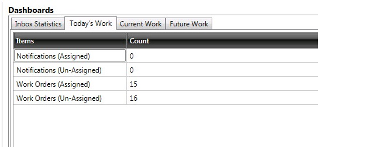

    
<strong>Note:</strong> This is still in early  development. Feel free to give feedback.

The **Dashboard** section displays the statistical information related to the inbox and also lists the pending activities that you have to complete. It also displays Today's Work, Current Work, and Future work which will show Items and the count.

## Inbox Statistics

The **Inbox Statistics** section displays the work items in your Inbox. It provides vital information about the work items such as the work type, the region of the work, the total items of a work item based upon area and work type, any tasks that need immediate attention (jeopardy), and tasks where the due date has already occurred. Clicking a row in the Inbox Statistics section displays the Inbox, runs an auto search, and filters the data as per the selected row.

## Pending Activities

The **Pending Activities** section displays all the pending activities that you have to complete. The work items are displayed according to work type. Clicking a row in the Pending Activities section displays the appropriate page, runs an auto search, and filters the data as per the selected row.

[Tensing USA](http://www.tensing.com/terms-and-conditions/) | [Terms & Conditions](http://www.tensing.com/terms-and-conditions/) | [Privacy and Disclaimer](http://www.tensing.com/privacy-statement-en-gb/)
