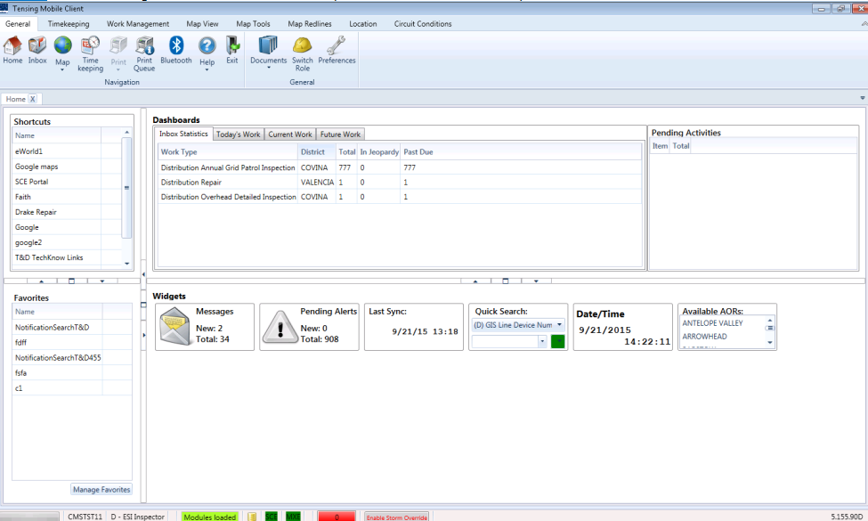

#### Menu

    
<strong>Note:</strong> This is still in early  development. Feel free to give feedback.

  
  
.

When a user opens the application, it directly routes to the home page. The homepage is customizable per user which allows the user to modify his/her home page with the following:

###### Shortcuts

- Users who have Administrative privileges or Supervisor privileges create a shortcut using the Portal application. These users can associate a shortcut with roles. All users who are assigned a role can see the associated shortcuts in their view.

###### [Favorites](./Menu/Favorites.md)

- Point to locations within the application

###### [Dashboards](\Navigation\Home\dashboards.md)

- Includes, Inbox Statistics, Today's Work, Current Work, and Future work

###### [Pending Activities](Pending-activities.md)

###### [Widgets](Widgets.md)

- Include Messages, Alerts, Last time the device synced with the server, Quick map search, Date/time, and available AORs which are work locations available to the user that is logged in.

    

_Tensing USA_ | [Terms & Conditions](http://www.tensing.com/terms-and-conditions/) | [Privacy and Disclaimer](http://www.tensing.com/privacy-statement-en-gb/)
